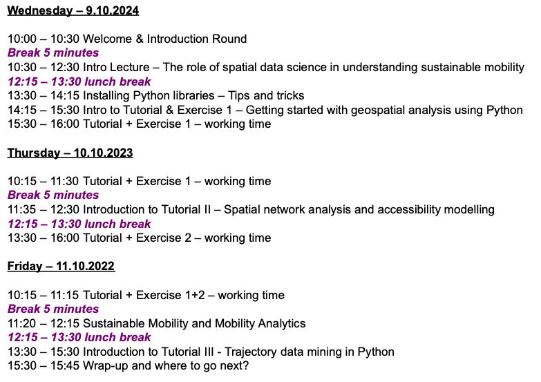

.. figure:: img/Sustainable_mobility_banner.png

*Special course*: **Spatial data science for sustainable mobility** deals with the use of spatial data science approaches to study sustainable mobility and accessibility in urban environments.

After participating in the event, the student is able to:

- Understand how human well-being and capabilities relate to mobility, and how those can be analyzed using computational approaches
- Use open-source spatial analysis libraries to study spatial mobility and accessibility
- Understand how modern computational technologies can be used to support open science and reproducible research
- Assess the selected analytical tools and understand their benefits and limitations

Course format
-------------

The majority of this course will be spent in front of a computer writing code with the Python language.
Most exercises in this course involve real world examples and data. For each exercise, you may be asked to
submit the Python codes you have written, output figures and answers to related questions.

.. admonition:: Interactive contents

    Each lesson in this course can be turned into an interactive programming session in the browser.
    You can find buttons for activating the python environment using `Binder <https://mybinder.readthedocs.io/en/latest/>`__ at the top of each programming lesson.
    Students at Finnish higher education institutions are encouraged to use the `CSC notebooks <https://notebooks.csc.fi/>`__ environment.

Program
-------

The planned schedule for the course:

Contents
--------

.. toctree::
   :maxdepth: 1
   :caption: Course information

   course-info/introduction
   course-info/course-info
   course-info/grading
   course-info/course-environment-components
   course-info/slack-usage
   course-info/License-terms
   course-info/attribution
   .. course-info/pair-programming

.. toctree::
   :maxdepth: 1
   :caption: Lesson 1

   lessons/L1/lesson-overview
   lessons/L1/sustainability-intro
   lessons/L1/spatial-data-science-intro
   lessons/L1/git-basics
   lessons/L1/intro-to-python-geostack.ipynb
   lessons/L1/literature
   lessons/L1/exercise-1

.. toctree::
   :maxdepth: 1
   :caption: Lesson 2

   lessons/L2/lesson-overview
   lessons/L2/wellbeing-capabilities
   lessons/L2/network-analytics-accessibility
   lessons/L2/spatial_network_analysis.ipynb
   lessons/L2/literature
   lessons/L2/exercise-2

.. toctree::
   :maxdepth: 1
   :caption: Lesson 3

   lessons/L3/lesson-overview
   lessons/L3/mobilities
   lessons/L3/trajectory-data-mining
   lessons/L3/mobility-analytics.ipynb
   lessons/L3/literature
   lessons/L3/exercise-3.ipynb

.. toctree::
   :maxdepth: 1
   :caption: Lesson 4

   lessons/L4/lesson-overview
   lessons/L4/economy
   lessons/L4/spatial_econometrics
   lessons/L4/spatial_regression.ipynb
   lessons/L4/literature
   lessons/L4/exercise-4

.. toctree::
   :maxdepth: 1
   :caption: Lesson 5

   lessons/L5/lesson-overview
   lessons/L5/agent-based-modelling
   lessons/L5/literature
   ..    lessons/L5/exercise-5

.. toctree::
   :maxdepth: 1
   :caption: Lesson 6

   ..  lessons/L6/lesson-overview
       lessons/L6/conservation-planning-spatial-prioritization
       lessons/L6/zonation-tutorial
       lessons/L6/literature

.. toctree::
   :maxdepth: 1
   :caption: Final Assignment

   lessons/final-assignment/final-assignment
   lessons/final-assignment/final-assignment-grading