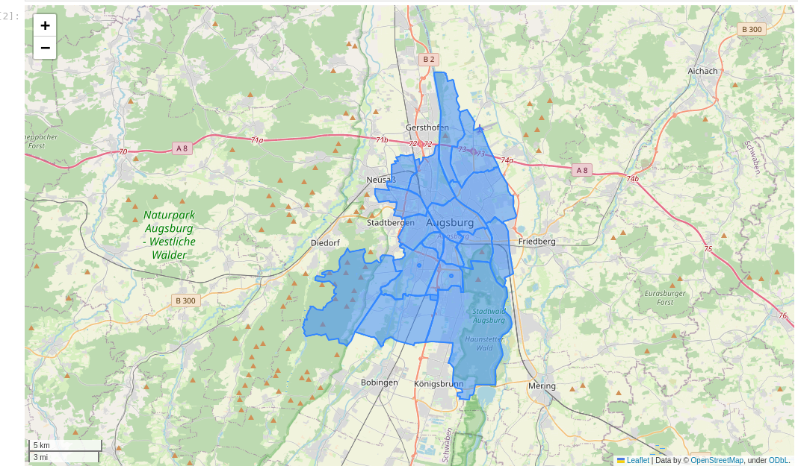

Exercises 1-2
=============

How to get started?
-------------------

Download the `exercise material package <https://drive.google.com/file/d/19P4GI_7AuH7Bajufci2VCWwKGnY_tj7W/view?usp=sharing>`__ if you haven't done it already. From this Zip file, you can find the `exercises` directory
and the Notebooks containing the instructions for the exercises. Notice that the Zipfile is relatively large (approx. 60-70 Mb) because it contains all the data needed
for the exercises (+ extra data for Augsburg).

Exerise 1
---------

In the Exercise 1, you will familiarize yourself with some basic functionalities of geopandas.

Exerise 2
---------

In the Exercise 2, you will familiarize yourself with network analysis and accessibility modelling using ``r5py`` and ``osmnx`` libraries.

Solutions
---------

I will provide example solutions for the exercises after the course (will send via email).

Hints
-----

In Exercise 1, you need to download the administrative boundaries for Augsburg. To do this, you can use `osmnx` with following code that will only download the "admin level 10" boundaries from OpenStreetMap (i.e. the districts):

.. code:: python

    import osmnx as ox

    query = "Augsburg, Germany"
    boundaries = ox.features_from_place(query, tags={"admin_level": "10"})
    boundaries.explore()

To download the buildings from the area of the boundaries, you can do following:

.. code:: python

    buildings = ox.features_from_polygon(boundaries.unary_union, tags={"building": True})

