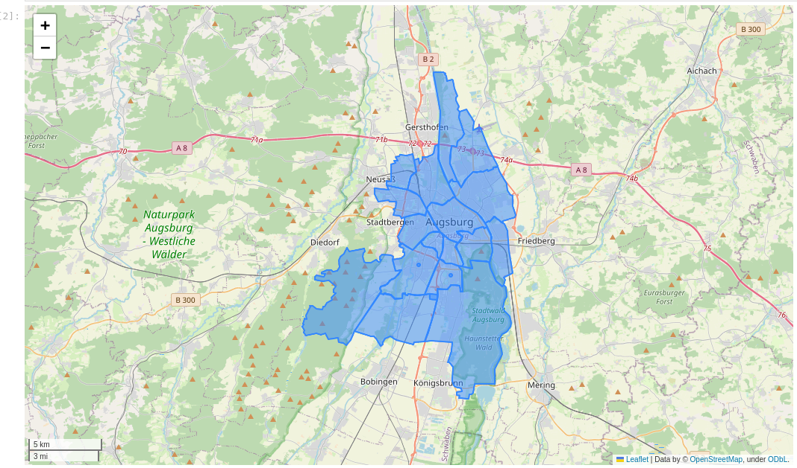

Exercises 1-2
=============

How to get started?
-------------------

Download the `exercise material package <https://drive.google.com/file/d/1i_RsQsMAqmBl-4eXrCudPtEwOiSNu64u/view?usp=sharing>`__ if you haven't done it already. In this Zip file, you can find the ``Exercises-2026`` folder
with the Notebooks containing the instructions for the exercises. Both exercises download their data during the exercise: Exercise 1 from OpenStreetMap with ``osmnx``, and Exercise 2 with ``transitio``.

Exercise 1
----------

In the Exercise 1, you will familiarize yourself with some basic functionalities of geopandas.

Exercise 2
----------

In the Exercise 2, you will download public transport and OpenStreetMap data for Prague, Czechia, with ``transitio``, and analyze accessibility and emissions by public transport and by bike with ``cafein``.
Follow the examples in Tutorial II. The downloads take roughly 10 minutes and need about 800 MB of disk space, so start them well before the exercise session.

Solutions
---------

I will provide example solutions for the exercises after the course (will send via email).

Hints
-----

In Exercise 1, you need to download the administrative boundaries for Augsburg. To do this, you can use `osmnx` with following code that will only download the "admin level 10" boundaries from OpenStreetMap (i.e. the districts):

.. code:: python

    import osmnx as ox

    query = "Augsburg, Germany"
    boundaries = ox.features_from_place(query, tags={"admin_level": "10"})
    boundaries.explore()

To download the buildings from the area of the boundaries, you can do following:

.. code:: python

    buildings = ox.features_from_polygon(boundaries.union_all(), tags={"building": True})

